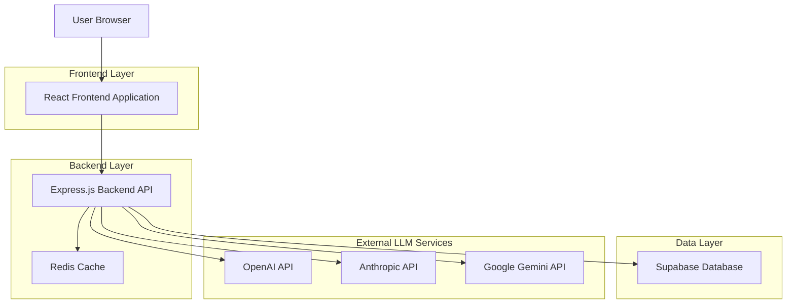
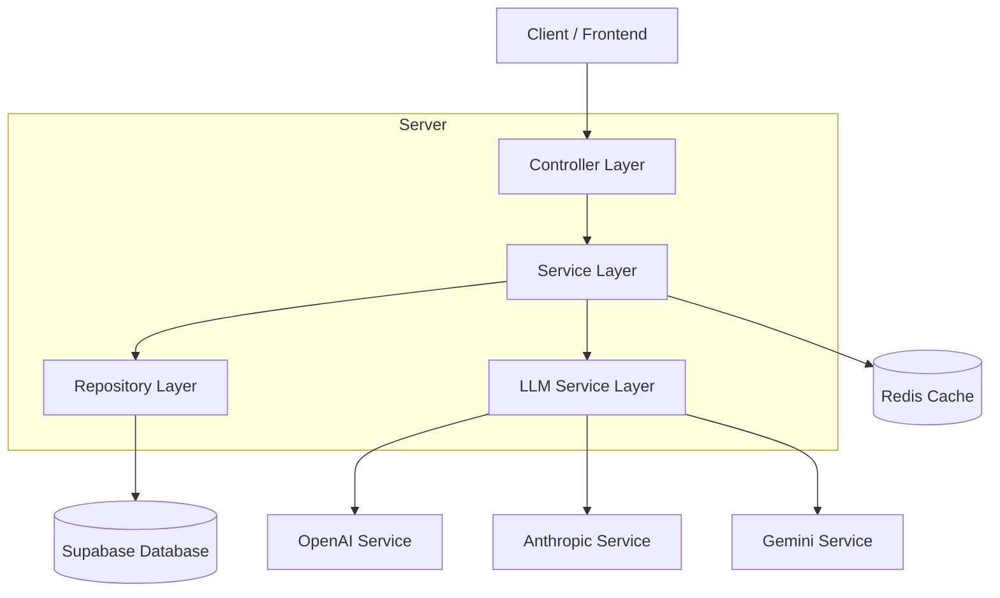
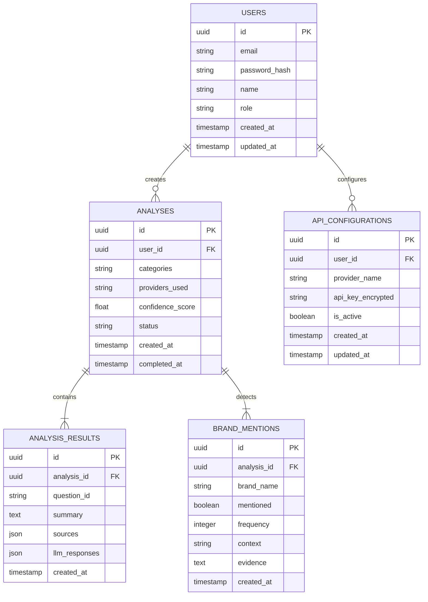

# Documento de Arquitectura Técnica - Mediciones IA Seguros

## 1. Architecture design



## 2. Technology Description

* **Frontend**: React\@18 + TypeScript + Tailwind CSS\@3 + Vite + Chart.js + React Router

* **Backend**: Express\@4 + TypeScript + Node.js\@22

* **Database**: Supabase (PostgreSQL)

* **Cache**: Redis

* **APIs**: OpenAI SDK, Anthropic SDK, Google AI SDK

## 3. Route definitions

| Route          | Purpose                                               |
| -------------- | ----------------------------------------------------- |
| /              | Dashboard principal con métricas y análisis recientes |
| /login         | Página de autenticación de usuarios                   |
| /analisis      | Configuración y ejecución de análisis de marca        |
| /informes/:id  | Visualización de informes específicos                 |
| /configuracion | Gestión de APIs LLM y parámetros del sistema          |
| /historial     | Archivo de análisis históricos y tendencias           |
| /perfil        | Configuración de usuario y preferencias               |

## 4. API definitions

### 4.1 Core API

**Autenticación de usuarios**

```
POST /api/auth/login
```

Request:

| Param Name | Param Type | isRequired | Description            |
| ---------- | ---------- | ---------- | ---------------------- |
| email      | string     | true       | Email del usuario      |
| password   | string     | true       | Contraseña del usuario |

Response:

| Param Name | Param Type | Description                   |
| ---------- | ---------- | ----------------------------- |
| success    | boolean    | Estado de la autenticación    |
| token      | string     | JWT token para sesiones       |
| user       | object     | Datos del usuario autenticado |

**Ejecución de análisis**

```
POST /api/analysis/execute
```

Request:

| Param Name | Param Type | isRequired | Description                           |
| ---------- | ---------- | ---------- | ------------------------------------- |
| categories | string\[]  | true       | Categorías a analizar                 |
| providers  | string\[]  | true       | Proveedores LLM a usar                |
| maxSources | number     | false      | Máximo número de fuentes (default: 6) |

Response:

| Param Name | Param Type | Description              |
| ---------- | ---------- | ------------------------ |
| analysisId | string     | ID único del análisis    |
| status     | string     | Estado del procesamiento |
| results    | object     | Resultados del análisis  |

**Obtener informes**

```
GET /api/reports/:id
```

Response:

| Param Name | Param Type | Description                 |
| ---------- | ---------- | --------------------------- |
| id         | string     | ID del informe              |
| markdown   | string     | Informe en formato Markdown |
| json       | object     | Datos estructurados JSON    |
| confidence | number     | Score de confianza (0-1)    |

**Configuración de APIs LLM**

```
PUT /api/config/llm-providers
```

Request:

| Param Name   | Param Type | isRequired | Description                |
| ------------ | ---------- | ---------- | -------------------------- |
| openaiKey    | string     | false      | Clave API de OpenAI        |
| anthropicKey | string     | false      | Clave API de Anthropic     |
| geminiKey    | string     | false      | Clave API de Google Gemini |

## 5. Server architecture diagram



## 6. Data model

### 6.1 Data model definition



### 6.2 Data Definition Language

**Tabla de usuarios (users)**

```sql
-- create table
CREATE TABLE users (
    id UUID PRIMARY KEY DEFAULT gen_random_uuid(),
    email VARCHAR(255) UNIQUE NOT NULL,
    password_hash VARCHAR(255) NOT NULL,
    name VARCHAR(100) NOT NULL,
    role VARCHAR(20) DEFAULT 'analyst' CHECK (role IN ('analyst', 'admin')),
    created_at TIMESTAMP WITH TIME ZONE DEFAULT NOW(),
    updated_at TIMESTAMP WITH TIME ZONE DEFAULT NOW()
);

-- create index
CREATE INDEX idx_users_email ON users(email);
CREATE INDEX idx_users_role ON users(role);

-- init data
INSERT INTO users (email, password_hash, name, role) VALUES
('admin@occident.com', '$2b$10$example_hash', 'Administrador Sistema', 'admin'),
('analista@occident.com', '$2b$10$example_hash', 'Analista Marketing', 'analyst');
```

**Tabla de análisis (analyses)**

```sql
-- create table
CREATE TABLE analyses (
    id UUID PRIMARY KEY DEFAULT gen_random_uuid(),
    user_id UUID NOT NULL REFERENCES users(id) ON DELETE CASCADE,
    categories TEXT[] NOT NULL,
    providers_used TEXT[] NOT NULL,
    confidence_score DECIMAL(3,2) DEFAULT 0.0,
    status VARCHAR(20) DEFAULT 'pending' CHECK (status IN ('pending', 'processing', 'completed', 'failed')),
    created_at TIMESTAMP WITH TIME ZONE DEFAULT NOW(),
    completed_at TIMESTAMP WITH TIME ZONE
);

-- create index
CREATE INDEX idx_analyses_user_id ON analyses(user_id);
CREATE INDEX idx_analyses_status ON analyses(status);
CREATE INDEX idx_analyses_created_at ON analyses(created_at DESC);
```

**Tabla de resultados de análisis (analysis\_results)**

```sql
-- create table
CREATE TABLE analysis_results (
    id UUID PRIMARY KEY DEFAULT gen_random_uuid(),
    analysis_id UUID NOT NULL REFERENCES analyses(id) ON DELETE CASCADE,
    question_id VARCHAR(50) NOT NULL,
    summary TEXT NOT NULL,
    sources JSONB NOT NULL DEFAULT '[]',
    llm_responses JSONB NOT NULL DEFAULT '{}',
    created_at TIMESTAMP WITH TIME ZONE DEFAULT NOW()
);

-- create index
CREATE INDEX idx_analysis_results_analysis_id ON analysis_results(analysis_id);
CREATE INDEX idx_analysis_results_question_id ON analysis_results(question_id);
```

**Tabla de menciones de marca (brand\_mentions)**

```sql
-- create table
CREATE TABLE brand_mentions (
    id UUID PRIMARY KEY DEFAULT gen_random_uuid(),
    analysis_id UUID NOT NULL REFERENCES analyses(id) ON DELETE CASCADE,
    brand_name VARCHAR(100) NOT NULL,
    mentioned BOOLEAN DEFAULT FALSE,
    frequency INTEGER DEFAULT 0,
    context VARCHAR(20) DEFAULT 'neutral' CHECK (context IN ('positive', 'negative', 'neutral')),
    evidence TEXT,
    created_at TIMESTAMP WITH TIME ZONE DEFAULT NOW()
);

-- create index
CREATE INDEX idx_brand_mentions_analysis_id ON brand_mentions(analysis_id);
CREATE INDEX idx_brand_mentions_brand_name ON brand_mentions(brand_name);
CREATE INDEX idx_brand_mentions_context ON brand_mentions(context);
```

**Tabla de configuraciones de API (api\_configurations)**

```sql
-- create table
CREATE TABLE api_configurations (
    id UUID PRIMARY KEY DEFAULT gen_random_uuid(),
    user_id UUID NOT NULL REFERENCES users(id) ON DELETE CASCADE,
    provider_name VARCHAR(50) NOT NULL,
    api_key_encrypted TEXT NOT NULL,
    is_active BOOLEAN DEFAULT TRUE,
    created_at TIMESTAMP WITH TIME ZONE DEFAULT NOW(),
    updated_at TIMESTAMP WITH TIME ZONE DEFAULT NOW(),
    UNIQUE(user_id, provider_name)
);

-- create index
CREATE INDEX idx_api_configurations_user_id ON api_configurations(user_id);
CREATE INDEX idx_api_configurations_provider ON api_configurations(provider_name);
CREATE INDEX idx_api_configurations_active ON api_configurations(is_active);
```

**Permisos de Supabase**

```sql
-- Permisos básicos para rol anon
GRANT SELECT ON users TO anon;
GRANT SELECT ON analyses TO anon;

-- Permisos completos para rol authenticated
GRANT ALL PRIVILEGES ON users TO authenticated;
GRANT ALL PRIVILEGES ON analyses TO authenticated;
GRANT ALL PRIVILEGES ON analysis_results TO authenticated;
GRANT ALL PRIVILEGES ON brand_mentions TO authenticated;
GRANT ALL PRIVILEGES ON api_configurations TO authenticated;
```

