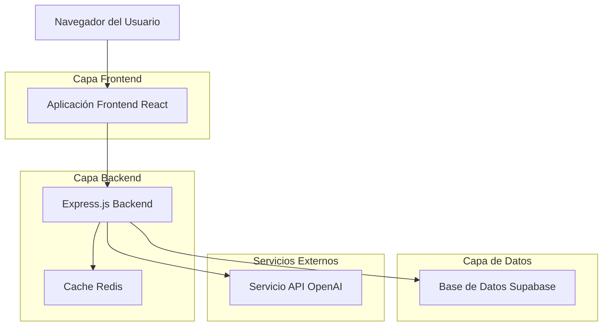
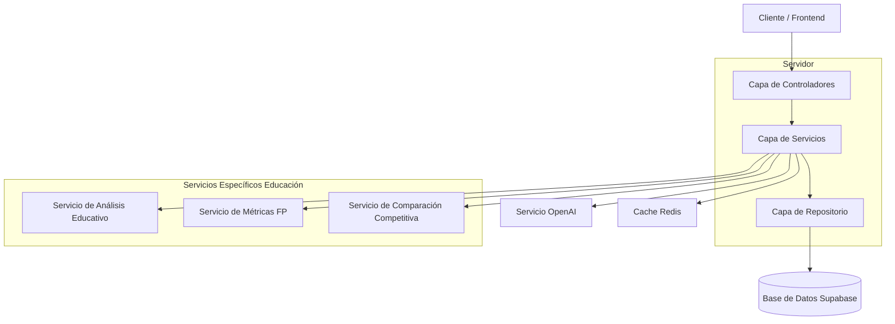
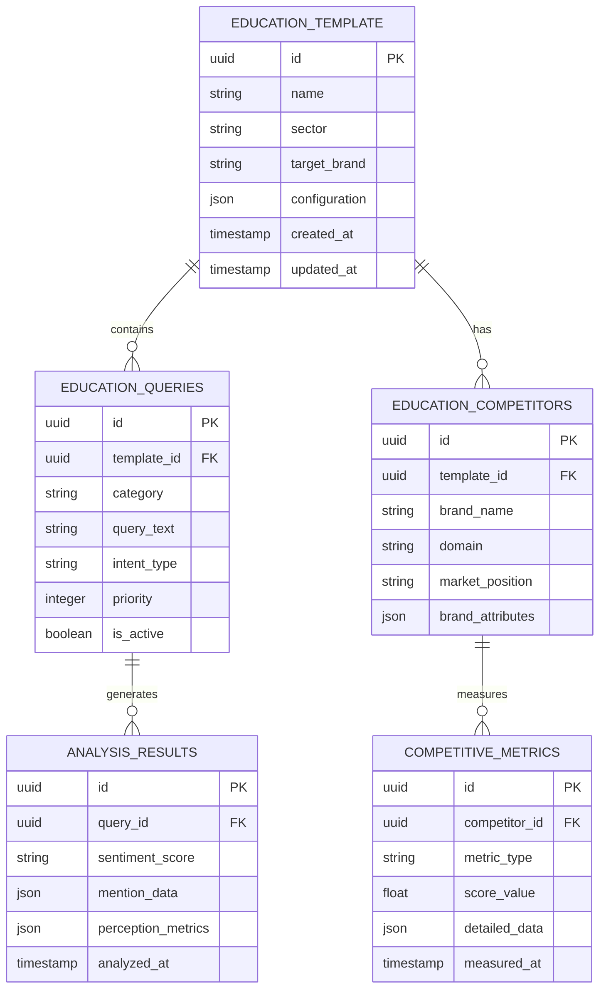

# Arquitectura Técnica - Plantilla de Educación: Ilerna Online

## 1. Diseño de Arquitectura



## 2. Descripción de Tecnología

* **Frontend**: React\@18 + TypeScript + TailwindCSS\@3 + Vite

* **Backend**: Express\@4 + Node.js + TypeScript

* **Base de Datos**: Supabase (PostgreSQL)

* **Cache**: Redis para optimización de consultas

* **IA**: OpenAI API para análisis de sentiment y procesamiento de texto

* **Autenticación**: Supabase Auth

## 3. Definiciones de Rutas

| Ruta           | Propósito                                                           |
| -------------- | ------------------------------------------------------------------- |
| /home          | Página de inicio con selector de plantilla educativa                |
| /analysis      | Página de análisis con configuración de consultas por categorías    |
| /dashboard     | Dashboard con métricas de percepción de Ilerna vs competidores      |
| /configuration | Configuración de consultas personalizadas y gestión de competidores |
| /reports       | Generación y exportación de reportes del sector educativo           |
| /history       | Historial de análisis realizados para la plantilla de educación     |

## 4. Definiciones de API

### 4.1 API Principal

**Obtener plantilla de educación**

```
GET /api/templates/educacion-ilerna
```

Respuesta:

| Nombre del Parámetro | Tipo de Parámetro | Descripción                          |
| -------------------- | ----------------- | ------------------------------------ |
| id                   | string            | Identificador único de la plantilla  |
| name                 | string            | "Educación - Ilerna Online"          |
| sector               | string            | "educacion"                          |
| targetBrand          | string            | "Ilerna Online"                      |
| competitors          | array             | Lista de competidores del sector     |
| queries              | object            | Consultas organizadas por categorías |

**Ejecutar análisis educativo**

```
POST /api/analysis/execute/educacion
```

Solicitud:

| Nombre del Parámetro | Tipo de Parámetro | Es Requerido | Descripción                        |
| -------------------- | ----------------- | ------------ | ---------------------------------- |
| templateId           | string            | true         | ID de la plantilla de educación    |
| categories           | array             | true         | Categorías de consultas a analizar |
| competitors          | array             | false        | Lista de competidores a incluir    |

Respuesta:

| Nombre del Parámetro | Tipo de Parámetro | Descripción                           |
| -------------------- | ----------------- | ------------------------------------- |
| analysisId           | string            | ID único del análisis ejecutado       |
| results              | object            | Resultados por categoría y competidor |
| sentiment            | object            | Análisis de sentimiento por marca     |
| metrics              | object            | Métricas de percepción calculadas     |

Ejemplo:

```json
{
  "templateId": "educacion-ilerna",
  "categories": ["descubrimiento", "flexibilidad", "preocupaciones"],
  "competitors": ["medac.es", "cesurformacion.com"]
}
```

## 5. Diagrama de Arquitectura del Servidor



## 6. Modelo de Datos

### 6.1 Definición del Modelo de Datos



### 6.2 Lenguaje de Definición de Datos

**Tabla de Plantilla de Educación (education\_templates)**

```sql
-- crear tabla
CREATE TABLE education_templates (
    id UUID PRIMARY KEY DEFAULT gen_random_uuid(),
    name VARCHAR(255) NOT NULL DEFAULT 'Educación - Ilerna Online',
    sector VARCHAR(50) NOT NULL DEFAULT 'educacion',
    target_brand VARCHAR(100) NOT NULL DEFAULT 'Ilerna Online',
    configuration JSONB DEFAULT '{}',
    created_at TIMESTAMP WITH TIME ZONE DEFAULT NOW(),
    updated_at TIMESTAMP WITH TIME ZONE DEFAULT NOW()
);

-- crear índices
CREATE INDEX idx_education_templates_sector ON education_templates(sector);
CREATE INDEX idx_education_templates_target_brand ON education_templates(target_brand);

-- datos iniciales
INSERT INTO education_templates (name, sector, target_brand, configuration) VALUES
('Educación - Ilerna Online', 'educacion', 'Ilerna Online', '{
  "focus_areas": ["fp_online", "flexibilidad", "practicas_fct", "empleabilidad"],
  "analysis_depth": "comprehensive",
  "sentiment_weights": {
    "calidad_academica": 0.3,
    "gestion_practicas": 0.25,
    "atencion_cliente": 0.2,
    "flexibilidad": 0.15,
    "empleabilidad": 0.1
  }
}');
```

**Tabla de Consultas Educativas (education\_queries)**

```sql
-- crear tabla
CREATE TABLE education_queries (
    id UUID PRIMARY KEY DEFAULT gen_random_uuid(),
    template_id UUID REFERENCES education_templates(id),
    category VARCHAR(100) NOT NULL,
    query_text TEXT NOT NULL,
    intent_type VARCHAR(50),
    priority INTEGER DEFAULT 1,
    is_active BOOLEAN DEFAULT true,
    created_at TIMESTAMP WITH TIME ZONE DEFAULT NOW()
);

-- crear índices
CREATE INDEX idx_education_queries_template_id ON education_queries(template_id);
CREATE INDEX idx_education_queries_category ON education_queries(category);
CREATE INDEX idx_education_queries_priority ON education_queries(priority DESC);

-- datos iniciales de consultas por categorías
INSERT INTO education_queries (template_id, category, query_text, intent_type, priority) VALUES
-- Categoría: Búsquedas Generales y de Descubrimiento
((SELECT id FROM education_templates WHERE target_brand = 'Ilerna Online'), 'descubrimiento', 'Opiniones sobre Ilerna Online', 'reputation_check', 1),
((SELECT id FROM education_templates WHERE target_brand = 'Ilerna Online'), 'descubrimiento', '¿Qué tal es Ilerna para estudiar un FP a distancia?', 'quality_inquiry', 1),
((SELECT id FROM education_templates WHERE target_brand = 'Ilerna Online'), 'descubrimiento', 'Experiencias de alumnos de Ilerna', 'user_experience', 1),
((SELECT id FROM education_templates WHERE target_brand = 'Ilerna Online'), 'descubrimiento', '¿Ilerna es un centro fiable y oficial?', 'credibility_check', 2),
((SELECT id FROM education_templates WHERE target_brand = 'Ilerna Online'), 'descubrimiento', 'Resumen de ventajas y desventajas de Ilerna', 'pros_cons_analysis', 1),

-- Categoría: Flexibilidad y Compatibilidad
((SELECT id FROM education_templates WHERE target_brand = 'Ilerna Online'), 'flexibilidad', '¿Puedo estudiar en Ilerna si trabajo a jornada completa?', 'work_compatibility', 1),
((SELECT id FROM education_templates WHERE target_brand = 'Ilerna Online'), 'flexibilidad', 'Mejor FP online para compaginar con trabajo y familia', 'life_balance', 1),
((SELECT id FROM education_templates WHERE target_brand = 'Ilerna Online'), 'flexibilidad', '¿Cómo funcionan las clases online en Ilerna? ¿Quedan grabadas?', 'platform_functionality', 2),
((SELECT id FROM education_templates WHERE target_brand = 'Ilerna Online'), 'flexibilidad', 'Estudiar a mi ritmo en Ilerna, ¿es posible?', 'self_paced_learning', 1),

-- Categoría: Preocupaciones y Verificación
((SELECT id FROM education_templates WHERE target_brand = 'Ilerna Online'), 'preocupaciones', 'Problemas con las prácticas de Ilerna', 'internship_issues', 1),
((SELECT id FROM education_templates WHERE target_brand = 'Ilerna Online'), 'preocupaciones', '¿Es verdad que Ilerna tarda mucho en asignar las prácticas?', 'internship_delays', 1),
((SELECT id FROM education_templates WHERE target_brand = 'Ilerna Online'), 'preocupaciones', '¿Es fácil aprobar en Ilerna?', 'academic_difficulty', 2),
((SELECT id FROM education_templates WHERE target_brand = 'Ilerna Online'), 'preocupaciones', 'Atención al alumno de Ilerna, ¿responden al teléfono?', 'customer_service', 1),

-- Categoría: Comparativas
((SELECT id FROM education_templates WHERE target_brand = 'Ilerna Online'), 'comparativas', 'Ilerna vs. Linkia FP, ¿cuál es mejor?', 'direct_comparison', 1),
((SELECT id FROM education_templates WHERE target_brand = 'Ilerna Online'), 'comparativas', 'Comparativa de centros FP online: Ilerna, Medac, Cesur', 'multi_comparison', 1),
((SELECT id FROM education_templates WHERE target_brand = 'Ilerna Online'), 'comparativas', 'Alternativas a Ilerna con mejor gestión de prácticas', 'alternative_search', 2),

-- Categoría: Empleabilidad
((SELECT id FROM education_templates WHERE target_brand = 'Ilerna Online'), 'empleabilidad', '¿El título de Ilerna está bien valorado por las empresas?', 'employer_recognition', 1),
((SELECT id FROM education_templates WHERE target_brand = 'Ilerna Online'), 'empleabilidad', 'Reputación de Ilerna en el mercado laboral', 'market_reputation', 1),
((SELECT id FROM education_templates WHERE target_brand = 'Ilerna Online'), 'empleabilidad', '¿Vale la pena pagar para estudiar en Ilerna?', 'roi_analysis', 2);
```

**Tabla de Competidores Educativos (education\_competitors)**

```sql
-- crear tabla
CREATE TABLE education_competitors (
    id UUID PRIMARY KEY DEFAULT gen_random_uuid(),
    template_id UUID REFERENCES education_templates(id),
    brand_name VARCHAR(100) NOT NULL,
    domain VARCHAR(255),
    market_position VARCHAR(50),
    brand_attributes JSONB DEFAULT '{}',
    created_at TIMESTAMP WITH TIME ZONE DEFAULT NOW()
);

-- crear índices
CREATE INDEX idx_education_competitors_template_id ON education_competitors(template_id);
CREATE INDEX idx_education_competitors_brand_name ON education_competitors(brand_name);

-- datos iniciales de competidores
INSERT INTO education_competitors (template_id, brand_name, domain, market_position, brand_attributes) VALUES
((SELECT id FROM education_templates WHERE target_brand = 'Ilerna Online'), 'Medac', 'medac.es', 'established_competitor', '{"specialties": ["fp_presencial", "fp_online"], "strengths": ["presencia_fisica", "variedad_cursos"]}'),
((SELECT id FROM education_templates WHERE target_brand = 'Ilerna Online'), 'Cesur Formación', 'cesurformacion.com', 'direct_competitor', '{"specialties": ["fp_online", "fp_dual"], "strengths": ["metodologia_online", "soporte_estudiante"]}'),
((SELECT id FROM education_templates WHERE target_brand = 'Ilerna Online'), 'Universae', 'universae.com', 'premium_competitor', '{"specialties": ["fp_superior", "grados"], "strengths": ["calidad_academica", "empleabilidad"]}'),
((SELECT id FROM education_templates WHERE target_brand = 'Ilerna Online'), 'Davante', 'davante.es', 'niche_competitor', '{"specialties": ["fp_sanitaria", "fp_tecnica"], "strengths": ["especializacion", "practicas_garantizadas"]}');
```

\-- Permisos de acceso

```sql
GRANT SELECT ON education_templates TO anon;
GRANT SELECT ON education_queries TO anon;
GRANT SELECT ON education_competitors TO anon;

GRANT ALL PRIVILEGES ON education_templates TO authenticated;
GRANT ALL PRIVILEGES ON education_queries TO authenticated;
GRANT ALL PRIVILEGES ON education_competitors TO authenticated;
```

