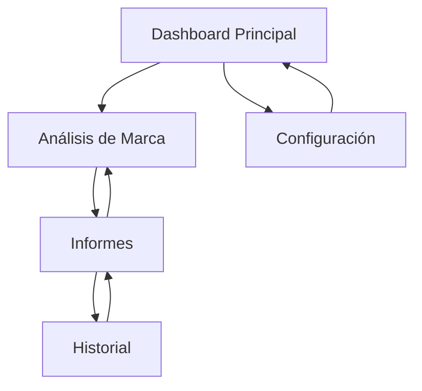

# Documento de Requisitos del Producto - Mediciones IA Seguros

## 1. Product Overview

Plataforma de análisis de marca especializada en el sector asegurador que conecta múltiples APIs de LLM para evaluar la presencia, reputación y posicionamiento competitivo de marcas de seguros en el mercado español.

- Propósito principal: Proporcionar análisis automatizado de menciones de marca y análisis competitivo en tiempo real para equipos de marketing de aseguradoras, específicamente enfocado en Occident/Catalana Occidente.
- Valor de mercado: Reducir el tiempo de análisis manual de 40 horas semanales a 2 horas, proporcionando insights accionables sobre posicionamiento de marca y estrategias competitivas.

## 2. Core Features

### 2.1 User Roles

| Role | Registration Method | Core Permissions |
|------|---------------------|------------------|
| Analista de Marketing | Registro por email + código de empresa | Puede ejecutar análisis, ver informes históricos, exportar datos |
| Administrador | Invitación del sistema | Gestión de usuarios, configuración de APIs, acceso completo a métricas |

### 2.2 Feature Module

Nuestros requisitos de análisis de marca en seguros consisten en las siguientes páginas principales:

1. **Dashboard Principal**: panel de control con métricas clave, análisis recientes, configuración de proveedores LLM.
2. **Análisis de Marca**: formulario de configuración de análisis, selección de categorías, ejecución de consultas paralelas a LLMs.
3. **Informes**: visualización de resultados en formato Markdown y JSON, comparativas competitivas, análisis de sentimiento.
4. **Configuración**: gestión de APIs LLM, configuración de marcas objetivo y competidores, lista blanca de fuentes.
5. **Historial**: archivo de análisis anteriores, tendencias temporales, exportación de datos.

### 2.3 Page Details

| Page Name | Module Name | Feature description |
|-----------|-------------|---------------------|
| Dashboard Principal | Panel de métricas | Mostrar KPIs de presencia de marca, gráficos de tendencias, estado de APIs LLM |
| Dashboard Principal | Análisis recientes | Listar últimos 5 análisis ejecutados con fecha, categoría y confidence score |
| Dashboard Principal | Configuración rápida | Acceso directo a configuración de proveedores LLM y estado de conexión |
| Análisis de Marca | Configuración de consulta | Seleccionar categorías (Hogar, Alquiler Vacacional, Marca y Confianza), configurar parámetros de análisis |
| Análisis de Marca | Ejecución paralela | Ejecutar consultas simultáneas a OpenAI, Anthropic y Gemini con indicador de progreso |
| Análisis de Marca | Procesamiento de datos | Deduplicar fuentes por dominio, aplicar lista blanca, calcular confidence score |
| Informes | Visualización Markdown | Renderizar informes legibles para humanos con análisis de presencia de marca |
| Informes | Exportación JSON | Generar datos estructurados para dashboards externos y análisis programático |
| Informes | Análisis competitivo | Comparar menciones entre marcas objetivo y competidores con contexto y frecuencia |
| Configuración | Gestión de APIs | Configurar claves de OpenAI, Anthropic, Google Gemini con validación de conexión |
| Configuración | Marcas y competidores | Editar listas de marcas objetivo, competidores y fuentes de lista blanca |
| Configuración | Parámetros del sistema | Configurar timezone, locale, número máximo de fuentes, umbrales de confidence |
| Historial | Archivo de análisis | Listar análisis históricos con filtros por fecha, categoría y marca |
| Historial | Tendencias temporales | Visualizar evolución de menciones de marca y sentiment a lo largo del tiempo |
| Historial | Exportación masiva | Exportar datos históricos en formatos CSV, JSON y PDF |

## 3. Core Process

**Flujo Principal del Analista:**
1. El usuario accede al dashboard y revisa métricas actuales
2. Navega a "Análisis de Marca" y selecciona categorías a analizar
3. El sistema ejecuta consultas paralelas a los 3 proveedores LLM configurados
4. Se procesan las respuestas, deduplicando fuentes y calculando confidence scores
5. Se genera el informe dual (Markdown + JSON) con análisis de menciones de marca
6. El usuario revisa los resultados en la página de "Informes"
7. Opcionalmente exporta los datos o los guarda en el historial

**Flujo del Administrador:**
1. Accede a "Configuración" para gestionar APIs y parámetros del sistema
2. Configura marcas objetivo, competidores y fuentes de lista blanca
3. Monitorea el historial de análisis y tendencias de uso
4. Exporta datos masivos para análisis externos

## 4. User Interface Design

### 4.1 Design Style

- **Colores primarios**: Azul corporativo (#1E40AF), Verde éxito (#059669), Rojo alerta (#DC2626)
- **Colores secundarios**: Gris claro (#F3F4F6), Gris medio (#6B7280), Blanco (#FFFFFF)
- **Estilo de botones**: Redondeados con sombra sutil, estados hover y disabled claramente diferenciados
- **Tipografía**: Inter como fuente principal, tamaños 14px (texto), 16px (botones), 24px (títulos)
- **Layout**: Diseño de tarjetas con navegación lateral fija, contenido principal centrado con máximo 1200px
- **Iconos**: Heroicons para consistencia, con énfasis en iconos de análisis, gráficos y configuración

### 4.2 Page Design Overview

| Page Name | Module Name | UI Elements |
|-----------|-------------|-------------|
| Dashboard Principal | Panel de métricas | Tarjetas con KPIs, gráficos de línea para tendencias, indicadores de estado con colores semafóricos |
| Dashboard Principal | Análisis recientes | Lista con avatares de categorías, badges de confidence score, timestamps relativos |
| Análisis de Marca | Configuración de consulta | Checkboxes para categorías, dropdown de proveedores LLM, slider para max_sources |
| Análisis de Marca | Ejecución paralela | Barra de progreso animada, spinners por proveedor, logs en tiempo real |
| Informes | Visualización Markdown | Renderizado con syntax highlighting, tablas responsivas, badges para sentiment |
| Informes | Análisis competitivo | Gráfico de barras comparativo, heatmap de menciones, tooltips informativos |
| Configuración | Gestión de APIs | Formularios con validación en tiempo real, indicadores de conexión, campos de password enmascarados |
| Historial | Tendencias temporales | Gráficos interactivos con Chart.js, filtros de fecha, leyendas dinámicas |

### 4.3 Responsiveness

Diseño desktop-first con adaptación móvil completa. La navegación lateral se convierte en menú hamburguesa en pantallas menores a 768px. Los gráficos y tablas se optimizan para touch interaction con scroll horizontal cuando sea necesario.