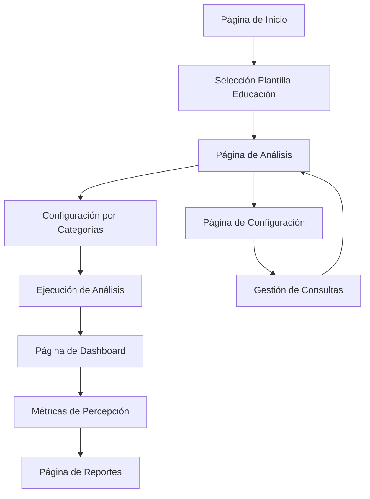

# PRD - Plantilla de Educación: Ilerna Online

## 1. Visión General del Producto

Sistema de análisis de percepción de marca especializado en el sector de Formación Profesional Online, centrado en Ilerna Online como marca objetivo. La plataforma permite analizar la reputación, calidad educativa, flexibilidad académica y empleabilidad en el mercado de FP a distancia.

- **Propósito principal**: Monitorear y analizar la percepción pública de Ilerna Online frente a sus competidores en aspectos críticos como gestión de prácticas, calidad académica, flexibilidad horaria y valor del título en el mercado laboral.
- **Valor objetivo**: Proporcionar insights estratégicos para mejorar la posición competitiva de Ilerna en el sector de educación online, identificando fortalezas y áreas de mejora basadas en feedback real de usuarios.

## 2. Características Principales

### 2.1 Roles de Usuario
| Rol | Método de Registro | Permisos Principales |
|-----|-------------------|---------------------|
| Analista Educativo | Acceso directo | Puede ejecutar análisis, ver reportes y configurar parámetros de monitoreo |
| Gestor de Marca | Acceso directo | Puede acceder a dashboards, exportar reportes y configurar alertas |

### 2.2 Módulo de Características

Nuestros requisitos de la plantilla de educación consisten en las siguientes páginas principales:

1. **Página de Inicio**: selector de plantilla educativa, navegación principal, resumen de métricas clave.
2. **Página de Análisis**: configuración de consultas por categorías, ejecución de análisis, visualización de resultados.
3. **Página de Dashboard**: métricas de percepción, comparativas competitivas, tendencias temporales.
4. **Página de Configuración**: gestión de consultas personalizadas, configuración de competidores, parámetros de análisis.
5. **Página de Reportes**: generación de informes, exportación de datos, análisis históricos.

### 2.3 Detalles de Página

| Nombre de Página | Nombre del Módulo | Descripción de Características |
|------------------|-------------------|-------------------------------|
| Página de Inicio | Selector de Plantilla | Seleccionar plantilla "Educación - Ilerna Online", mostrar métricas destacadas del sector educativo |
| Página de Inicio | Panel de Navegación | Acceso rápido a análisis, dashboard y configuración específica del sector educativo |
| Página de Análisis | Configuración de Consultas | Organizar consultas en 5 categorías: Descubrimiento, Flexibilidad, Preocupaciones, Comparativas, Empleabilidad |
| Página de Análisis | Ejecución de Análisis | Procesar consultas sobre Ilerna vs competidores (Medac, Cesur, Universae, Davante) |
| Página de Análisis | Visualización de Resultados | Mostrar sentiment analysis, menciones por categoría, análisis comparativo de percepción |
| Página de Dashboard | Métricas de Percepción | Indicadores de reputación, satisfacción estudiantil, calidad percibida |
| Página de Dashboard | Análisis Competitivo | Comparación directa con Medac, Cesur, Universae, Davante en métricas clave |
| Página de Dashboard | Tendencias Temporales | Evolución de la percepción de marca, identificación de patrones estacionales |
| Página de Configuración | Gestión de Consultas | Crear, editar y categorizar consultas específicas del sector FP online |
| Página de Configuración | Configuración de Competidores | Gestionar lista de competidores y sus dominios web |
| Página de Reportes | Generación de Informes | Crear reportes personalizados por categoría de consulta o competidor |
| Página de Reportes | Exportación de Datos | Exportar análisis en formatos PDF, Excel para presentaciones ejecutivas |

## 3. Proceso Principal

**Flujo del Analista Educativo:**
El usuario accede a la plataforma, selecciona la plantilla "Educación - Ilerna Online", configura las consultas por categorías (desde búsquedas generales hasta empleabilidad), ejecuta el análisis comparativo con competidores, revisa los resultados en el dashboard con métricas de percepción y genera reportes ejecutivos.

**Flujo del Gestor de Marca:**
El usuario accede al dashboard para revisar métricas actuales de percepción de Ilerna, compara rendimiento con competidores, identifica áreas críticas (como gestión de prácticas o atención al cliente), configura alertas para consultas específicas y exporta reportes para presentaciones estratégicas.

## 4. Diseño de Interfaz de Usuario

### 4.1 Estilo de Diseño

- **Colores primarios**: Azul educativo (#1E40AF), Verde académico (#059669)
- **Colores secundarios**: Gris profesional (#6B7280), Naranja alerta (#EA580C)
- **Estilo de botones**: Redondeados con sombras suaves, estilo académico profesional
- **Fuente**: Inter para textos principales (16px), Roboto Mono para datos (14px)
- **Estilo de layout**: Diseño basado en tarjetas con navegación lateral, estilo dashboard educativo
- **Iconos**: Iconos de educación (libros, graduación, certificados), estilo outline minimalista

### 4.2 Resumen de Diseño de Página

| Nombre de Página | Nombre del Módulo | Elementos de UI |
|------------------|-------------------|-----------------|
| Página de Inicio | Selector de Plantilla | Card destacada con icono de graduación, colores azul educativo, tipografía clara Inter 18px |
| Página de Análisis | Configuración de Consultas | Tabs organizados por categorías, colores diferenciados por tipo de consulta, iconos específicos |
| Página de Dashboard | Métricas de Percepción | Gráficos circulares para sentiment, barras comparativas, paleta azul-verde académica |
| Página de Configuración | Gestión de Consultas | Formularios con validación, botones de acción verde académico, layout de dos columnas |
| Página de Reportes | Generación de Informes | Tablas con alternancia de colores, botones de exportación naranja, preview de documentos |

### 4.3 Responsividad

El producto está diseñado desktop-first con adaptación móvil completa. Incluye optimización táctil para tablets educativos y navegación simplificada en dispositivos móviles para consultas rápidas de métricas.